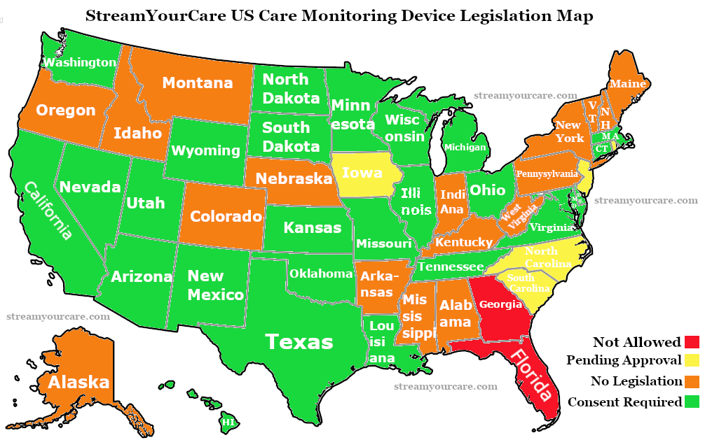

# States

| ✅ | 🟡 | ⌛ | 🚫 | ✖️ |
|---|---|---|---|---|
| 
[Approved]
 |  
[Authorization Needed]
 |  
[Proposed]
 | 
[Dropped/Failed to Pass]
 |  
[No Legislation Found]
 |

| State | Status |
|---|:---:|
| Alabama |✖️|
| Alaska |✖️|
| [Arizona](https://des.az.gov/sites/default/files/media/DDD_Provider_Manual_Chapter_42_Electronic_Monitoring_in_Program_Sites.pdf) |🟡|
| Arkansas |✖️|
| [California](https://healthworkforce.ucsf.edu/remote-monitoring-technology-long-term-care)  | ✅ |
| Colorado |✖️|
| [Connecticut](https://portal.ct.gov/ltcop/resident-technology-and-camera-use-in-long-term-care) |✅| 
| Delaware |✖️|
| [Florida](https://www.forddean.com/blog/2023/04/new-bill-could-allow-electronic-monitoring-devices-in-florida-long-term-care-facilities/) |🚫|
| Georgia |🚫|
| Hawaii |✅|
| Idaho |✖️|
| [Illinois](https://ilaging.illinois.gov/content/dam/soi/en/web/aging/programs/ltcombudsman/documents/electronic-monitoring-presentation.pdf) |✅|
| Indiana |✖️|
| Iowa |⌛|
| [Kansas](https://kslegislature.org/li_2018/b2017_18/measures/documents/summary_hb_2232_2018.pdf) | ✅ |
| Kentucky |✖️|
| [Louisiana](https://ldh.la.gov/assets/medicaid/hss/docs/NH/NF_VirtualVisitationAct596_12142018.pdf) | ✅ |
| Maine |✖️|
| [Maryland](https://health.maryland.gov/ohcq/docs/Reports/149report.pdf) |🟡|
| [Massachusetts](https://www.mass.gov/doc/doc-468-electronic-monitoring-program/download) |🟡|
| [Michigan](https://www.legislature.mi.gov/documents/2001-2002/billanalysis/House/htm/2001-HLA-5603-s.htm) |🟡|
| [Minnesota](https://www.health.state.mn.us/facilities/regulation/emonitoring/index.html) |✅|
| Mississippi |✖️|
| [Missouri](https://documents.house.mo.gov/billtracking/bills201/hlrbillspdf/3240H.02I.pdf) |✅|
| Montana |✖️|
| Nebraska |✖️|
| [Nevada](https://www.leg.state.nv.us/App/NELIS/REL/82nd2023/Bill/9916/Overview) |🟡|
| New Hampshire |✖️|
| New Jersey |⌛|
| [New Mexico](https://www.nmlegis.gov/sessions/04%20Regular/final/SB0401.html) |🟡|
| New York |✖️|
| North Carolina |⌛|
| [North Dakota](https://legiscan.com/ND/bill/SB2113/2019) |🟡|
| [Ohio](https://aging.ohio.gov/care-and-living/get-help/get-an-advocate/esthers-law) | ✅ |
| [Oklahoma](https://law.justia.com/codes/oklahoma/2020/title-63/section-63-1-1953-5/) |🟡|
| Oregon |✖️|
| Pennsylvania |✖️|
| Rhode Island |⌛|
| South Carolina |⌛|
| [South Dakota](https://sdlegislature.gov/Session/Bill/10353/62123) |🟡|
| [Tennessee](https://wapp.capitol.tn.gov/apps/BillInfo/Default.aspx?BillNumber=SB2695&ga=111) |🟡|
| [Texas](https://www.hhs.texas.gov/sites/default/files/documents/laws-regulations/forms/0065/0065.pdf) |🟡|
| [Utah](https://le.utah.gov/~2016/bills/hbillint/HB0124.htm) |🟡|
| Vermont |✖️|
| [Virginia](https://register.dls.virginia.gov/details.aspx?id=7163) |🟡|
| [Washington](https://apps.leg.wa.gov/WAC/default.aspx?cite=388-97) |🟡|
| West Virginia |✖️|
| [Wisconsin](https://www.dhs.wisconsin.gov/memLaws allow for the use of electronic monitoring devices with consent and notice requirements.os/16-001.pdf) |🟡|
| [Wyoming](https://health.wyo.gov/aging/hls/electronic-monitoring-of-long-term-care/) |🟡|

- [Arizona](https://des.az.gov/sites/default/files/Chapter%2042%20Electronic%20Monitoring%20Surveillance%20System%20In%20Program%20Sites%20Final%2005.01.15.pdf) - Legislation allows for electronic monitoring in common areas with certain conditions

- [California](https://healthworkforce.ucsf.edu/remote-monitoring-technology-long-term-care) - Residents have the right to use electronic monitoring with consent and notice to the family

- [Connecticut ✅](https://portal.ct.gov/ltcop/resident-technology-and-camera-use-in-long-term-care) -  

- [Kansas ✅](https://kslegislature.org/li_2018/b2017_18/measures/documents/summary_hb_2232_2018.pdf) (HB 2232) - Has the "Authorized Electronic Monitoring in Long-Term Care Facilities Act" which permits residents to install monitoring devices in rooms under certain conditions.

- [Louisiana ✅](https://ldh.la.gov/assets/medicaid/hss/docs/NH/NF_VirtualVisitationAct596_12142018.pdf) - Allows for the installation and use of monitoring devices in nursing home rooms with consent

- [Michigan](https://www.legislature.mi.gov/documents/2001-2002/billanalysis/House/htm/2001-HLA-5603-s.htm) - Request permission from facility

- [Minnesota](https://www.health.state.mn.us/facilities/regulation/emonitoring/index.html) ✅
Give written consent (see links to consent forms below).
If they have a roommate, get written consent from the roommate or the roommate’s representative (see links to consent forms below).

- [Missouri ✅](https://documents.house.mo.gov/billtracking/bills201/hlrbillspdf/3240H.02I.pdf) - allows residents to use monitoring devices in their rooms. requires consent from roommates and releases facilities from liability for privacy violations or HIPAA breaches due to device use 

- [Nevada](https://ltc.health.mo.gov/wp-content/uploads/sites/18/2020/08/Guidance-for-LTC-Facilities-Regarding-Electronic-Monitoring-Device-Placement.pdf) - Authorized by request

- [North Dakota](https://legiscan.com/ND/bill/SB2113/2019+-) - State law clarifies that residents and their legally authorized representatives can place and use authorized electronic monitoring devices in their rooms

- [Oklahoma](https://law.justia.com/codes/oklahoma/2020/title-63/section-63-1-1953-5/) - Residents or their representatives can monitor their rooms using electronic devices with consent from roommates.

- [Ohio](https://aging.ohio.gov/care-and-living/get-help/get-an-advocate/esthers-law) - Esther's Law in Ohio requires facilities to make reasonable accommodations and prohibits retaliation against residents who choose to install these devices

## Updated and organized soon