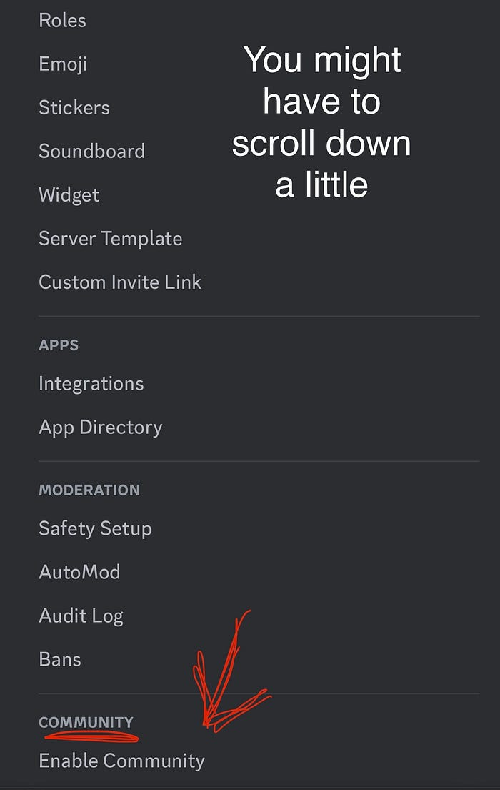

# Care Streamer Discord Setup

This tutorial will walk you through how to set up a Discord community with pre-made roles that are pinged via !alert in your stream chat.

### Needs:
- [OBS](https://obsproject.com/download)
- [Streamer.Bot](https://streamer.bot/downloads) ([!alert config](configs.md))
- Discord Account ([Sign Up](https://discordapp.com/register))
- Twitch Account ([Sign Up](https://www.twitch.tv/signup))
- Discord ([Download](https://discord.com/download))

### Server Setup
* Create a server using the [Care Stream Template](https://discord.new/HJAHUaRdafaK)

#### Channels in Care Stream Template
---

#### Roles in Care Stream Template
---
* [Enable Community](https://support.discord.com/hc/en-us/articles/360047132851-Enabling-Your-Community-Server) in the Server Settings

---
#### Set up Server Onboarding with the following messages:

#### Care Stream Server Community Onboarding Recommended
---
🚨Be pinged by !alert in stream chat: Desc: A care stream alert role for friends, family, and community.

#### Settings for Alert Role
---
##### 🎬: Collaboration with the owner of this channel 
Helps livestreamers in long-term care facilities provide engaging and empowering content

##### Settings for Collaborator Role
---
🔔: Be notified when this streamer goes live. Desc: The advocate live ping role enables a steady stream of companion care for care streamers.

#### Settings for Live Ping Notifications
---

If you have any questions, join our [Discord](https://discord.com/invite/VrgXPhAJEa) or join the discussion on Reddit at [r/streamyourcare](https://www.reddit.com/r/streamyourcare/)